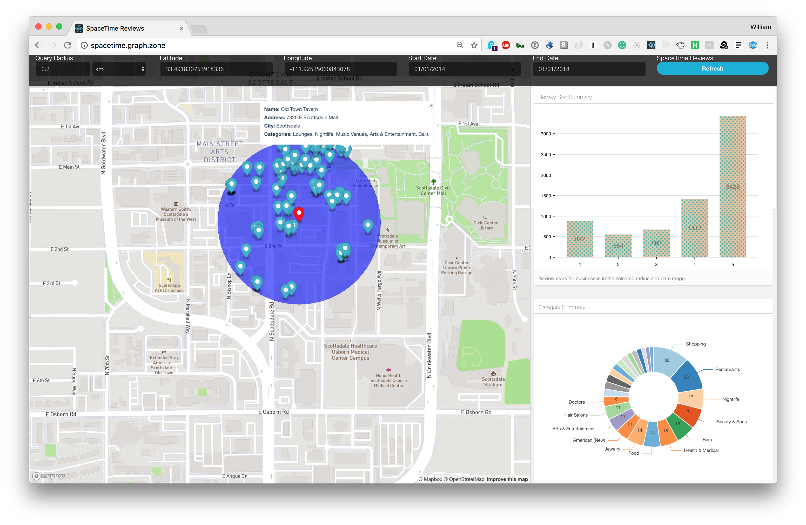

## spacetime-reviews

A React app to demonstrate how to use the spatial and temporal functionality introduced in Neo4j 3.4. It makes use of:

* [create-react-app](https://github.com/facebook/create-react-app)
* [neo4j-javascript-driver](https://github.com/neo4j/neo4j-javascript-driver)
* [Mapbox GL JS](https://www.mapbox.com/mapbox-gl-js/api/)
* [Nivo charts](http://nivo.rocks/)



## Installation 

Set environment variables:

```
REACT_APP_NEO4J_URI=XXX
REACT_APP_NEO4J_USER=XXX
REACT_APP_NEO4J_PASSWORD=XXX
REACT_APP_MAPBOX_TOKEN=XXX
```

these can be added to `.env`

Clone this git repo, and then

```
npm install
npm start
```

